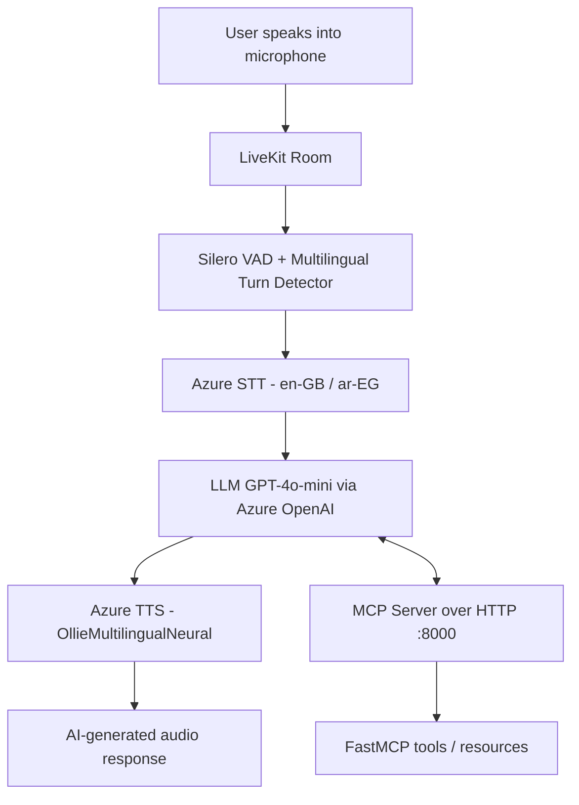

# 🎙️ MCP LiveKit ENG-AR Agent - Bilingual Voice AI Assistant

[](https://www.python.org/downloads/)
[](https://github.com/livekit/agents)
[](https://azure.microsoft.com/)
[](https://openai.com/)
[](https://modelcontextprotocol.io/)
[](LICENSE)

**MCP LiveKit ENG-AR Agent** is a real-time bilingual (English/Arabic) voice AI assistant built with **LiveKit Agents**, Azure AI services, and the **Model Context Protocol (MCP)**. It lets users speak naturally to the system, processes the input through Speech-to-Text (STT) and LLM reasoning, and replies with AI-generated speech in either English or Arabic.

---

## ✨ Key Features

### 🎯 1. Real-Time Speech-to-Text (STT)
- Converts spoken input into text in real time using **Azure STT**.
- Configured with `en-GB` and `ar-EG` languages to support bilingual conversations.

### 🧠 2. LLM Reasoning & Response Generation
- Processes transcribed text with **GPT-4o-mini** (deployed via Azure OpenAI) to produce intelligent, context-aware replies.
- A custom `Assistant` agent instructs the model to detect the user's language choice and keep responding in that language.

### 🔊 3. Natural Text-to-Speech (TTS)
- Generates lifelike audio responses with **Azure TTS** using the multilingual `en-GB-OllieMultilingualNeural` voice.
- Supports `en-GB` and `ar-EG` so responses match the conversation language.

### 🌐 4. MCP Server Integration
- Connects the agent to a **FastMCP** server exposed over streamable HTTP (`http://127.0.0.1:8000/mcp/`).
- The demo MCP server provides `add`, `subtract`, and `user_info` tools, a `greeting://{name}` resource, and a greeting prompt.

### 🌍 5. Bilingual & Code-Switching Support
- Understands and responds in both **English and Arabic**, handling code-switching mid-conversation.
- Uses **Silero VAD**, a multilingual turn detector, and BVC noise cancellation for clean, low-latency interaction.

---

## 🏗️ System Architecture



---

## 🛠️ Technology Stack

### Backend / Core
- **Voice Agent Framework**: [LiveKit Agents](https://github.com/livekit/agents) `~1.2` with the `azure`, `openai`, `silero`, `turn-detector`, and `mcp` plugins.
- **LLM**: GPT-4o-mini served through Azure OpenAI (`azure_deployment="gpt-4o-mini"`).
- **STT / TTS**: Azure Speech services (`en-GB`, `ar-EG`).
- **Noise Cancellation**: `livekit-plugins-noise-cancellation` (BVC).

### Data & Processing
- **Voice Activity Detection**: Silero VAD.
- **Turn Detection**: Multilingual turn detector for bilingual conversations.

### MCP / Tooling
- **Model Context Protocol**: FastMCP server (`mcp[cli]` `>=1.14.1`) with tools, resources, and prompts over streamable HTTP.
- **Config**: `python-dotenv` for `.env.local` secrets.

---

## 🚀 Getting Started

### Prerequisites
- **Python 3.11+**
- **uv** (dependency manager)
- **LiveKit** cloud project credentials
- **Azure** Speech + OpenAI deployment keys
- **MCP** server setup (included in this repo)

### 1. Repository Setup
```bash
git clone https://github.com/MarwanAbdellah/MCP_Livekit_ENG-AR_Agent.git
cd MCP_Livekit_ENG-AR_Agent
```

### 2. Install Dependencies
```bash
pip install uv
uv sync
```

### 3. Configure Environment
Create a `.env.local` file in the project root (loaded by `agent.py`):
```env
LIVEKIT_API_KEY=your_livekit_key
LIVEKIT_API_SECRET=your_livekit_secret
LIVEKIT_URL=wss://your-project.livekit.cloud
AZURE_SPEECH_KEY=your_azure_speech_key
AZURE_OPENAI_ENDPOINT=your_azure_openai_endpoint
AZURE_OPENAI_API_KEY=your_azure_openai_key
```

### 4. Run
Start the voice agent worker:
```bash
cd livekit-voice-agent
uv run python agent.py
```

Test in console mode:
```bash
uv run python agent.py console
```

Start the MCP server (separate terminal):
```bash
cd mcp-server-demo
uv run python main.py
```

The agent will listen to your microphone, process speech in real time, and respond with AI-generated audio in English or Arabic.

---

## 🧪 Testing & Verification

There are no automated tests in this repository. To verify the workflow:

1. Start the MCP server, then launch the agent worker.
2. Join the LiveKit room and speak - confirm you are asked which language to use.
3. Respond in either English or Arabic and verify the agent replies in the chosen language and handles code-switching correctly.
4. Confirm the MCP tools (`add`, `subtract`, `user_info`) and `greeting` resource respond correctly over HTTP.

---

## 📁 Project Structure

```text
MCP_Livekit_ENG-AR_Agent/
├── livekit-voice-agent/       # Main LiveKit voice agent
│   ├── agent.py               # Agent entry point: STT, LLM, TTS, MCP wiring
│   ├── pyproject.toml         # Project dependencies (uv)
│   └── uv.lock                # Locked dependency versions
├── mcp-server-demo/           # FastMCP demo server
│   ├── main.py                # MCP tools, resources, and prompts
│   ├── pyproject.toml         # mcp[cli] dependency
│   └── uv.lock                # Locked dependency versions
├── .gitignore
├── .gitattributes
└── README.md
```

---

## 👤 Author

**Marwan Abdellah**
- **GitHub**: [@MarwanAbdellah](https://github.com/MarwanAbdellah)
- **LinkedIn**: [Marwan Abdellah](https://www.linkedin.com/in/marwan-abdellah/)

---

## 📄 License

Distributed under the MIT License. See `LICENSE` for more information.
